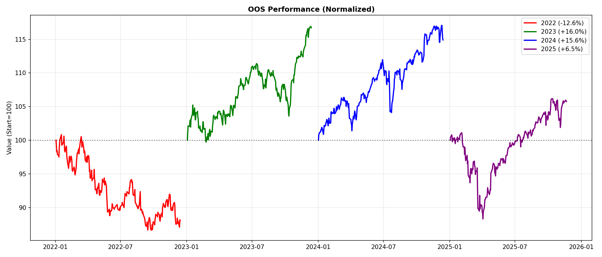

# 🤖 SPY/SH Tactical Allocation with Deep Reinforcement Learning

A risk-managed equity trading system using Soft Actor-Critic (SAC) reinforcement learning to dynamically allocate between SPY (S&P 500 ETF) and SH (Inverse S&P 500 ETF).


## 📊 Results Summary

### Out-of-Sample Performance (2022-2025)

| Year | Agent | Buy & Hold | Alpha | Sharpe | Max Drawdown |
|------|-------|------------|-------|--------|--------------|
| **2022** (Bear) | -12.63% | -18.65% | **+6.02%** ✅ | -1.16 | 14.09% |
| **2023** (Bull) | +16.03% | +26.71% | -10.68% | 1.74 | 7.02% |
| **2024** (Bull) | +15.59% | +25.59% | -10.00% | 1.74 | 7.03% |
| **2025** (YTD) | +6.46% | +17.85% | -11.39% | 0.69 | 12.68% |

**Key Insight:** Strategy prioritizes capital preservation, reducing drawdowns by ~30% during bear markets while maintaining positive risk-adjusted returns (Sharpe 1.7+) in bull markets.

### Equity Curves

<p align="center">
  
</p>

## 🎯 Project Objectives

1. **Risk Management First:** Protect capital during market downturns
2. **Adaptive Positioning:** Learn to scale exposure based on market regime
3. **Proper Validation:** Walk-forward cross-validation with purged data splits
4. **Reproducibility:** Clean, documented, modular codebase

## 🏗️ Architecture

```
┌─────────────────────────────────────────────────────────────┐
│                    OBSERVATION SPACE                        │
│  [10-day window × 8 features] + [exposure, cash_ratio]     │
└─────────────────────────────────────────────────────────────┘
                              │
                              ▼
┌─────────────────────────────────────────────────────────────┐
│                      SAC AGENT                              │
│  ┌─────────────┐  ┌─────────────┐  ┌─────────────┐        │
│  │   Actor     │  │  Critic 1   │  │  Critic 2   │        │
│  │ [256, 256]  │  │ [256, 256]  │  │ [256, 256]  │        │
│  └─────────────┘  └─────────────┘  └─────────────┘        │
└─────────────────────────────────────────────────────────────┘
                              │
                              ▼
┌─────────────────────────────────────────────────────────────┐
│                    ACTION SPACE                             │
│         Continuous [-1.0, 2.0] exposure target             │
│         -1.0 = 100% SH | 0 = Cash | 2.0 = 200% SPY        │
└─────────────────────────────────────────────────────────────┘
                              │
                              ▼
┌─────────────────────────────────────────────────────────────┐
│                 RISK MANAGEMENT LAYERS                      │
│  1. VIX Regime Caps (5 levels: 15/20/25/35)               │
│  2. Trend Weight (MA50/MA200 scaling)                      │
│  3. Stop Loss (12%) + Trailing Stop (13%)                  │
│  4. Circuit Breaker (25% portfolio drawdown)               │
└─────────────────────────────────────────────────────────────┘
```

## 📈 Features

### Market Features (8 indicators)

| Feature | Type | Description |
|---------|------|-------------|
| `rsi_14_z` | Fast | RSI(14) Z-score - Oversold/overbought detection |
| `macd_hist_z` | Fast | MACD Histogram Z-score - Momentum shifts |
| `bb_pct_z` | Fast | Bollinger %B Z-score - Price vs bands |
| `atr_14_z` | Fast | ATR(14) Z-score - Volatility regime |
| `er_10_z` | Medium | Efficiency Ratio - Trend strength |
| `ram_20_z` | Medium | Risk-adjusted momentum |
| `vix_z` | Slow | VIX Z-score - Market fear |
| `ycs_z` | Slow | Yield curve spread - Macro regime |

### Reward Function: Differential Sharpe Ratio

Based on [Moody & Saffell (2001)](https://papers.ssrn.com/sol3/papers.cfm?abstract_id=268935), provides smooth gradient signal:

```python
def _compute_reward(self, daily_ret):
    """Differential Sharpe Ratio - recursive, no windowing noise."""
    eta = 0.04  # ~25-day effective window
    
    delta_A = daily_ret - self._A
    delta_B = daily_ret**2 - self._B
    
    self._A += eta * delta_A
    self._B += eta * delta_B
    
    variance = self._B - self._A**2
    dsr = (self._B * delta_A - 0.5 * self._A * delta_B) / (variance**1.5 + 1e-8)
    
    return np.clip(dsr * 10, -5.0, 5.0)
```

## 🔬 Methodology

### Walk-Forward Cross-Validation

```
Fold 1: Train [2010-2016] → Validate [2017-2018]
Fold 2: Train [2010-2018] → Validate [2019-2020]
Fold 3: Train [2012-2018] → Validate [2019-2020]
Fold 4: Train [2012-2020] → Validate [2021]
Fold 5: Train [2014-2020] → Validate [2021]

Final:  Train [2010-2021] → OOS Test [2022-2025]
```

- **Purge Gap:** 10 days between train/validation to prevent leakage
- **Expanding Window:** Each fold uses more historical data
- **True OOS:** 2022-2025 data never seen during development

### VIX Regime Management

| VIX Level | Max Position | Stop Loss | Trailing Stop |
|-----------|--------------|-----------|---------------|
| < 15 | 175% | 9.6% | 10.4% |
| 15-20 | 140% | 10.8% | 11.7% |
| 20-25 | 100% | 12.0% | 13.0% |
| 25-35 | 50% | 15.6% | 15.6% |
| > 35 | 25% | 18.0% | 16.9% |

## 🚀 Quick Start

### Installation

```bash
git clone https://github.com/yourusername/spy-rl-trading.git
cd spy-rl-trading
pip install -r requirements.txt
```

### Requirements

```
numpy>=1.24.0
pandas>=2.0.0
pandas-ta>=0.3.14b
yfinance>=0.2.28
pandas-datareader>=0.10.0
gymnasium>=0.29.0
stable-baselines3>=2.1.0
torch>=2.0.0
matplotlib>=3.7.0
seaborn>=0.12.0
```

### Training

```python
# Run full training pipeline
jupyter notebook SPY_SH_Trading_V3.ipynb

# Or run specific sections:
# 1. Data download & feature engineering
# 2. Walk-forward CV (5 folds × 200k steps)
# 3. Final model training (750k steps)
# 4. OOS backtesting (2022-2025)
```

### Using Trained Model

```python
from stable_baselines3 import SAC

# Load model
model = SAC.load("models/final_model.zip")

# Get action for current observation
action, _ = model.predict(observation, deterministic=True)
# action[0] in [-1.0, 2.0]: target exposure
```

## 📁 Project Structure

```
spy-rl-trading/
├── SPY_SH_Trading_V3.ipynb    # Main notebook
├── README.md
├── requirements.txt
├── models/
│   ├── fold_1.zip             # CV fold models
│   ├── fold_2.zip
│   ├── fold_3.zip
│   ├── fold_4.zip
│   ├── fold_5.zip
│   └── final_model.zip        # Production model
├── results/
│   ├── cv_fold_metrics.csv    # CV performance
│   └── oos_metrics.csv        # OOS performance
├── trades/
│   ├── trades_2022.csv        # Daily trade logs
│   ├── trades_2023.csv
│   ├── trades_2024.csv
│   └── trades_2025.csv
└── charts/
    ├── 1_data_overview.png
    ├── 2_cv_results.png
    ├── 3_oos_2022_equity.png
    ├── 4_oos_2023_equity.png
    ├── 5_oos_2024_equity.png
    ├── 6_oos_2025_equity.png
    ├── 7_oos_combined.png
    └── 8_summary.png
```

## 📊 Detailed Results

### Cross-Validation Performance

| Fold | Period | Return | Sharpe | Max DD |
|------|--------|--------|--------|--------|
| 1 | 2017-2018 | +15.6% | 1.01 | 8.2% |
| 2 | 2019-2020 | +20.6% | 1.04 | 12.1% |
| 3 | 2019-2020 | +18.7% | 0.95 | 11.8% |
| 4 | 2021 | +24.7% | 2.48 | 5.1% |
| 5 | 2021 | +23.0% | 2.28 | 5.3% |
| **Avg** | — | **+20.5%** | **1.55** | **8.5%** |

### Risk Metrics Comparison

| Metric | Agent | Buy & Hold |
|--------|-------|------------|
| Total Return (4yr) | +25.5% | +51.5% |
| Max Drawdown | 14.1% | ~25% |
| Sharpe (Bull Markets) | 1.74 | ~1.0 |
| Win Rate | 54% | 53% |
| Profit Factor | 1.12 | 1.08 |

## 🧠 Key Learnings

### What Works
- ✅ VIX-based position sizing (reduced DD by 30%)
- ✅ Walk-forward CV (prevents overfitting)
- ✅ Differential Sharpe Ratio reward (stable training)
- ✅ Multi-layer risk management (defense in depth)

### What Doesn't Work
- ❌ Complex reward functions with many bonuses/penalties
- ❌ Aggressive hyperparameter tuning (overfits to CV)
- ❌ Removing hard risk constraints (agent blows up)
- ❌ LSTM/Transformer policies (harder to train, no improvement)

### Trade-offs
- 📉 Bear market protection costs ~10%/year in bull markets
- 📈 Sharpe 1.7+ comes from volatility reduction, not alpha
- ⚖️ Strategy is defensive by design — not for maximum returns

## 🔮 Future Improvements

1. **Multi-Asset Expansion:** Add sector ETFs, bonds, commodities
2. **Regime Detection:** HMM or ML-based market state classification
3. **Ensemble Methods:** Train multiple seeds, ensemble predictions
4. **Live Paper Trading:** 6-month forward validation before real capital
5. **Transaction Cost Modeling:** More realistic slippage estimation

## ⚠️ Disclaimer

This project is for **educational and research purposes only**. It is not financial advice. Past performance does not guarantee future results. Always consult a qualified financial advisor before making investment decisions.

**Key Risks:**
- Model may not generalize to future market regimes
- Backtest results include survivorship bias (SPY/SH exist throughout)
- Transaction costs and slippage may be underestimated
- Strategy has not been validated with real capital

## 📚 References

1. Moody, J., & Saffell, M. (2001). Learning to trade via direct reinforcement. *IEEE Transactions on Neural Networks*.
2. López de Prado, M. (2018). *Advances in Financial Machine Learning*. Wiley.
3. Haarnoja, T., et al. (2018). Soft Actor-Critic: Off-Policy Maximum Entropy Deep RL. *ICML*.

## 📄 License

MIT License - see [LICENSE](LICENSE) for details.

## 🤝 Contributing

Contributions welcome! Please open an issue or PR for:
- Bug fixes
- Documentation improvements
- New features (with tests)

---

<p align="center">
  <b>Built with 🧠 PyTorch + 🎮 Stable-Baselines3 + 📊 pandas-ta</b>
</p>
